

  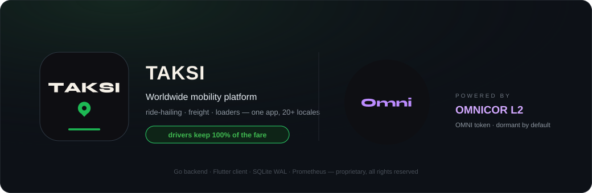

  
  
  
  

> **Public product showcase.** TAKSI is a proprietary platform — this repository presents the product, its architecture and economics. The source code lives in a private monorepo.

A worldwide ride-hailing, freight, and loaders platform — passenger app, driver app, dispatch backend, and admin console in one codebase.

**Core economics:** drivers keep 100% of the fare with instant payout on ride completion. The platform monetizes through a flat shift subscription instead of per-ride commission. Passenger fares are set by a proprietary dynamic pricing engine tuned per city and vehicle class.

---

## Architecture

  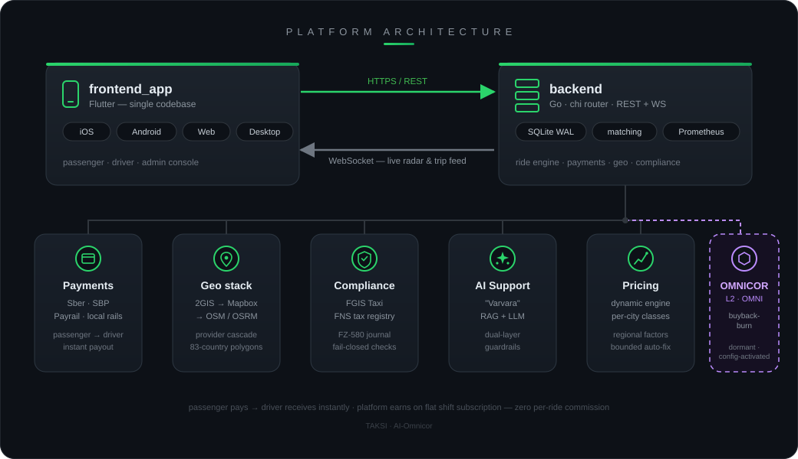

## How the money flows

  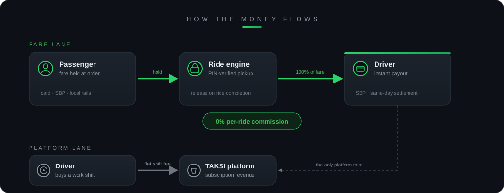

## Screenshots

  
  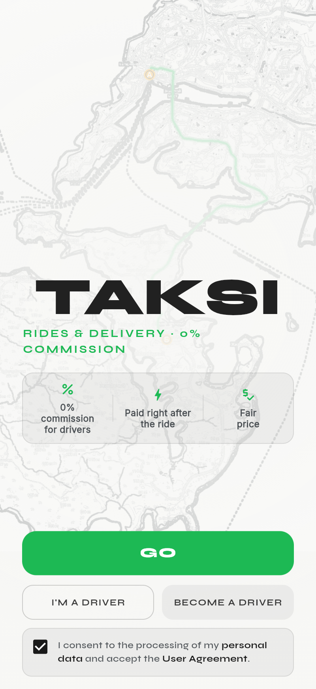
  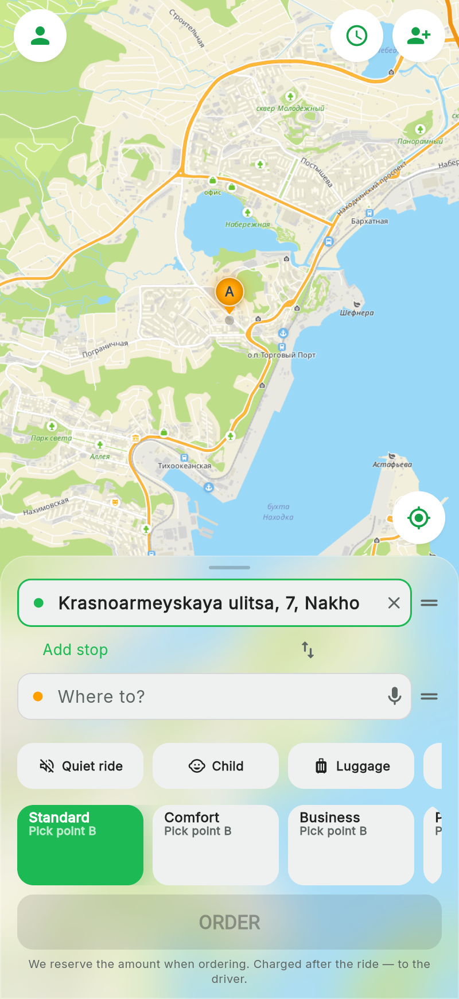

  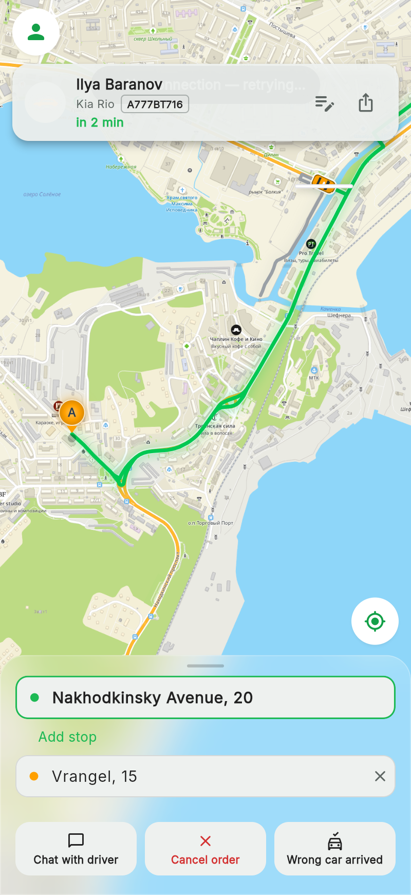
  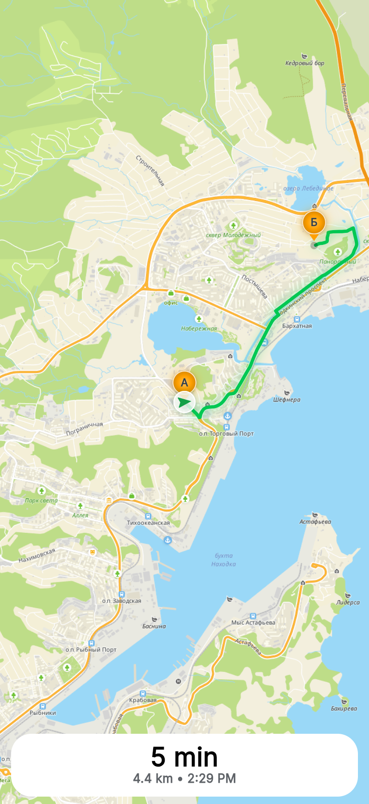
  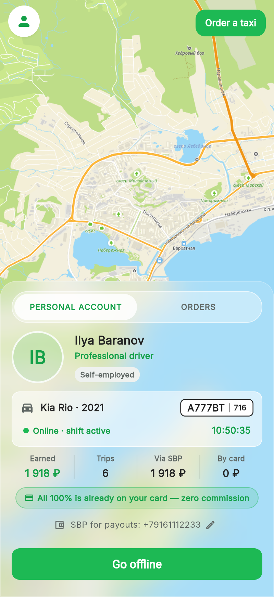

## What's inside

  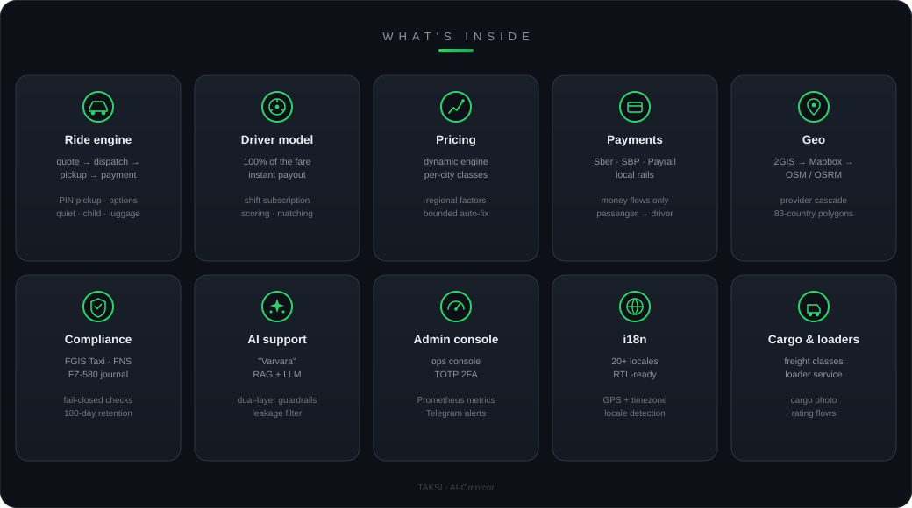

## OMNICOR ecosystem integration

  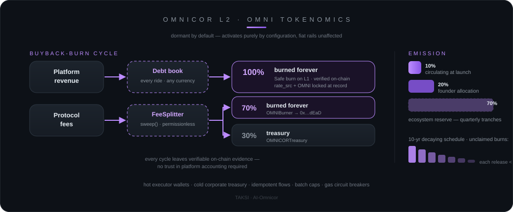

  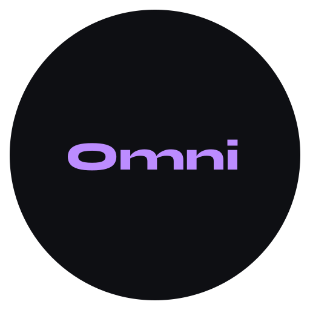
  TAKSI is wired into the <a href="https://github.com/AI-Omnicor">OMNICOR</a>
  network — an independent L2 blockchain with the OMNI utility token.
  The integration is dormant by default and activates purely by
  configuration; the platform ships and operates fully on fiat rails.

Every completed ride books a rouble-denominated buyback obligation —
a public debt ledger with no OMNI price locked in. A Safe periodically
burns the matching OMNI on L1: **100% of the taxi buyback is destroyed**
(public `totalBurned` counter). Protocol fees flow through an immutable
FeeSplitter — **70% burned, 30% to the Treasury** on every `sweep()`.
Emission is staged — 10% circulating, 20% founder allocation, 70%
ecosystem reserve released in ~40 quarterly tranches over 10 years;
unclaimed tranches burn automatically. Supply only ever shrinks.
Custody is split between hot executor wallets and cold corporate
addresses whose keys never touch the server.

## Engineering

  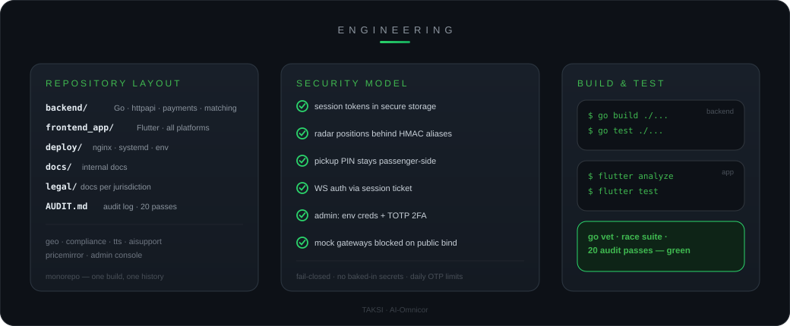

## License

Proprietary — All Rights Reserved.

---
